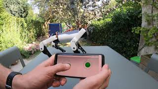

# SpotMicro ESP32

This repository is a bunch of code which I use to develop the SpotMicro ESP32 which is designed by Michael Kubina.

His repository with all the parts and a great assembly guide can be found on https://github.com/michaelkubina/SpotMicroESP32

This SpotMicro is based on https://spotmicroai.readthedocs.io/en/latest/

Discussions about the project and the other SpotMicro Projects are on slack: https://spotmicroai-inviter.herokuapp.com/

## Intermediate test

## Code in this repo
The code on this repo is mostly based on the esp-idf :https://docs.espressif.com/projects/esp-idf/en/latest/esp32/ and is fully in development

There is also an early version of  (Android / ios) app to control the Spot using BLE, developped using Cordova: https://cordova.apache.org/

